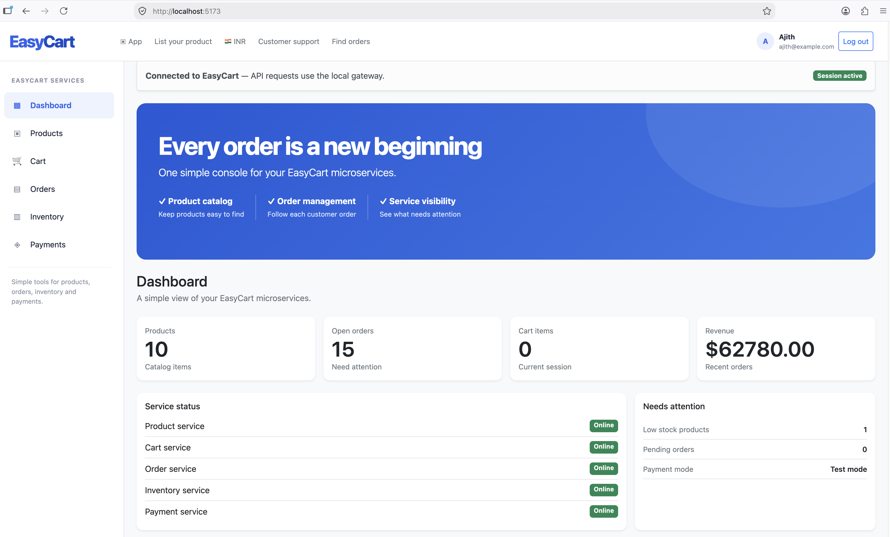
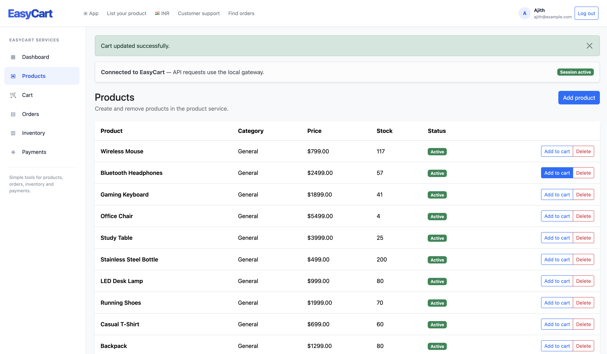
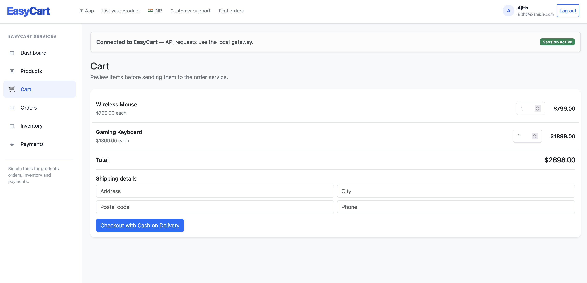
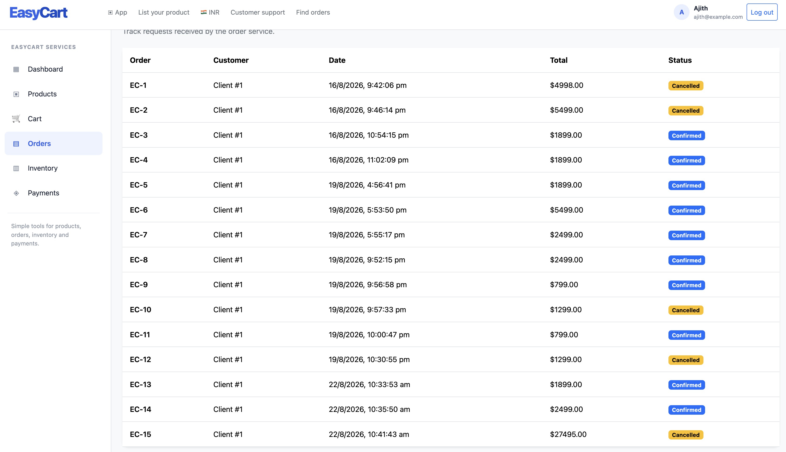
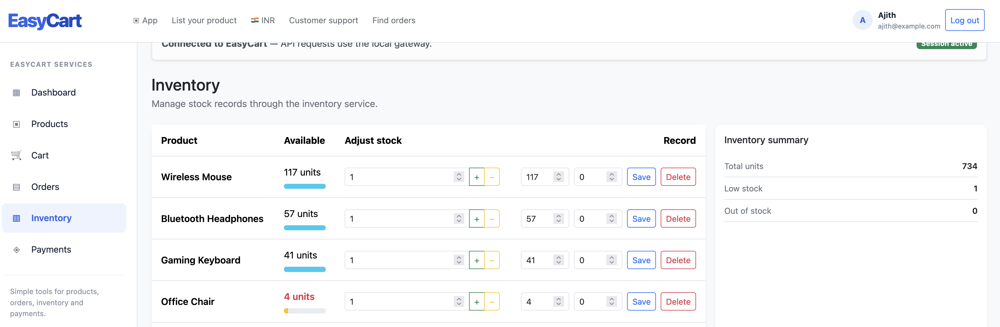

# EasyCart

> A cloud-ready e-commerce platform that demonstrates a practical .NET microservices architecture—from a React storefront to asynchronous inventory reservation.

[](https://dotnet.microsoft.com/)
[](https://react.dev/)
[](https://www.typescriptlang.org/)
[](https://www.postgresql.org/)
[](https://www.docker.com/)
[](https://masstransit.io/)
[](https://azure.microsoft.com/products/service-bus/)
[](https://opentelemetry.io/)

## Why EasyCart?

EasyCart is a portfolio project for exploring the parts of an e-commerce system that become interesting in production: independently deployed services, database ownership, asynchronous order processing, resilient caching, observability, and cloud-safe configuration.

The React UI gives the system a real user journey—browse products, update a cart, check out with Cash on Delivery, and observe the order transition to **Confirmed** or **Cancelled** after inventory reservation.

## Product tour

| Dashboard | Product catalogue |
| --- | --- |
|  |  |
| Service health, product, order, cart, revenue, and low-stock views. | Product catalogue with stock visibility and cart feedback. |

| Cart and checkout | Orders and inventory |
| --- | --- |
|  |  |
| Cart review, quantity updates, shipping details, and COD checkout. | Confirmed and cancelled asynchronous order outcomes. |



*Inventory operations include live stock levels, low-stock visibility, and controlled adjustments.*

## Architecture

```text
React + TypeScript frontend
             |
             v
      Ocelot API Gateway
             |
  +----------+----------+-----------------+
  |          |          |                 |
  v          v          v                 v
Auth API  Product API  Order API      Inventory API
  |          |          |                 |
Postgres  Postgres   Postgres       Postgres
             |          |
           Redis    MassTransit
                         |
          RabbitMQ (local) / Azure Service Bus (Azure)
```

Each service owns its data and exposes a focused API. Shared cross-cutting concerns—JWT setup, structured logging, tracing, exception handling, and dependency registration—live in `EasyCart.SharedLibrary`.

### Order lifecycle

```text
Checkout
  → Order API persists a Pending order
  → OrderPlacedEvent is published
  → Inventory API atomically reserves stock
  → InventoryReservationSucceededEvent or InventoryReservationFailedEvent
  → Order API marks the order Confirmed or Cancelled
```

The stock reservation uses a conditional database update in a serializable transaction, so inventory cannot go below zero even under concurrent checkouts.

## Highlights

- **React user experience** — product discovery, cart updates, checkout, orders, and inventory management.
- **API gateway** — Ocelot provides a single edge endpoint, routing, JWT enforcement, caching, and rate-limiting capabilities.
- **Event-driven workflow** — MassTransit separates order placement from inventory reservation.
- **Transport by environment** — RabbitMQ is the development default; Azure Service Bus is selected outside Development or by setting `Messaging__Transport=AzureServiceBus`.
- **Database per service** — PostgreSQL-backed Auth, Product, Order, and Inventory APIs own their data.
- **Resilient product cache** — Redis is optional. The Product API falls back to PostgreSQL and logs a warning if Redis is absent or unavailable.
- **Security and configuration** — JWT authentication and Azure Key Vault configuration using `DefaultAzureCredential`.
- **Observability** — OpenTelemetry tracing, Jaeger/OTLP support, correlation IDs, and Serilog structured logs under `Serilog/<ApiName><yyyyMMdd>.log`.
- **Resiliency** — Polly policies in the Order API for transient faults.

## Technology stack

| Area | Technology |
| --- | --- |
| Frontend | React, TypeScript, Vite |
| Backend | ASP.NET Core 8, C#, Entity Framework Core |
| Gateway | Ocelot |
| Data | PostgreSQL, Redis (optional) |
| Messaging | MassTransit, RabbitMQ, Azure Service Bus |
| Security | JWT, Azure Key Vault, `DefaultAzureCredential` |
| Observability | OpenTelemetry, OTLP, Jaeger, Serilog |
| Local infrastructure | Docker Compose |

## Project structure

```text
EasyCart/
├── EasyCart/
│   ├── EasyCart.ApiGateway/        # Gateway and edge configuration
│   ├── EasyCart.AuthApi/           # Identity and JWT issuance
│   ├── EasyCart.ProductApi/        # Catalogue and optional Redis cache
│   ├── EasyCart.OrderApi/          # Cart, checkout, and order state
│   ├── EasyCart.InventoryApi/      # Stock records and reservation consumer
│   ├── EasyCart.SharedLibrary/     # Cross-cutting infrastructure
│   └── EasyCart.AppHost/           # .NET Aspire orchestration host
├── docs/images/                    # README product screenshots
└── README.md
```

The React frontend is maintained in the sibling `easy-cart-web` project.

## Run locally

### Prerequisites

- .NET 8 SDK
- Node.js 20+ and npm
- Docker Desktop
- A local PostgreSQL instance with the Auth, Product, Order, and Inventory databases configured for the APIs
- Azure CLI sign-in (`az login`) when reading development secrets from Azure Key Vault

### 1. Start local infrastructure

From the backend solution directory:

```bash
cd EasyCart
docker compose -f docker-compose-development.yml up -d
```

This starts RabbitMQ, Redis, Redis Insight, and Jaeger. RabbitMQ is used automatically in the Development environment.

### 2. Start the backend

```bash
dotnet run --project EasyCart.AppHost
```

The Aspire host starts the gateway and APIs. Configure the PostgreSQL connection strings and any required development secrets before running.

### 3. Start the frontend

```bash
cd ../easy-cart-web
npm install
npm run dev
```

Open the Vite URL shown in the terminal (typically `http://localhost:5173`). The UI sends requests through the local gateway.

### Local service tools

| Tool | Address |
| --- | --- |
| RabbitMQ Management | `http://localhost:15672` |
| Redis Insight | `http://localhost:8001` |
| Jaeger | `http://localhost:16686` |

## Messaging configuration

The default is deliberately environment-aware:

```csharp
var messagingTransport = builder.Configuration["Messaging:Transport"]
    ?? (builder.Environment.IsDevelopment() ? "RabbitMQ" : "AzureServiceBus");
```

For a local integration test against Azure Service Bus, keep the Development environment and override only the transport:

```bash
Messaging__Transport=AzureServiceBus dotnet run --project EasyCart.AppHost
```

Store the namespace connection string as the Azure Key Vault secret `ConnectionStrings--EasycartServiceBus`. The Key Vault configuration provider maps `--` to `:` so it becomes `ConnectionStrings:EasycartServiceBus` at runtime. Do not commit connection strings or secrets.

## Observability and logs

- Browse distributed traces in Jaeger when using the local OTLP endpoint.
- Inspect structured application logs in the `Serilog` directory created by each API.
- Monitor Azure Service Bus queues, topics, active messages, and dead-letter messages in the Azure portal when testing the cloud transport.

## Future improvements

- Add automated unit, integration, and end-to-end test suites
- Add CI/CD with GitHub Actions
- Deploy APIs and frontend with Azure Container Apps or App Service
- Use managed PostgreSQL and Azure Managed Redis in production
- Add payments, notifications, and a customer-facing order-tracking experience

## Author

**Ajith Nair**

---

If you found this project useful, consider starring the repository.
